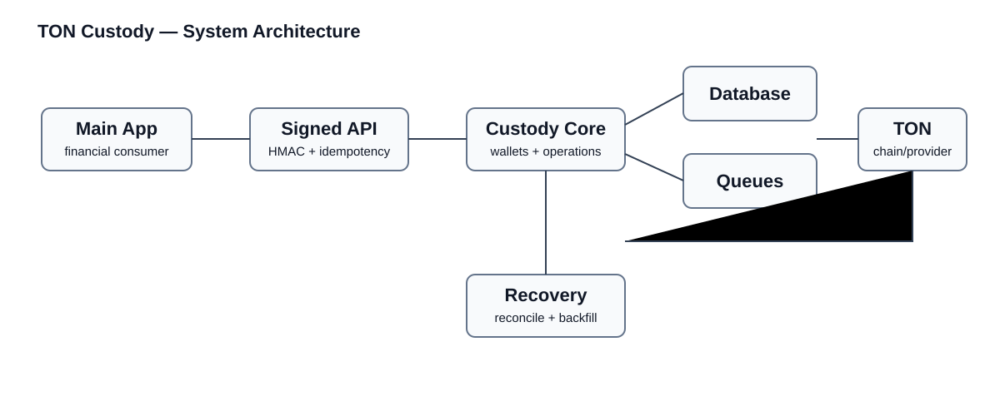
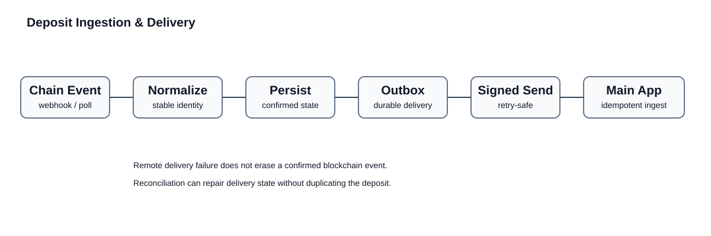
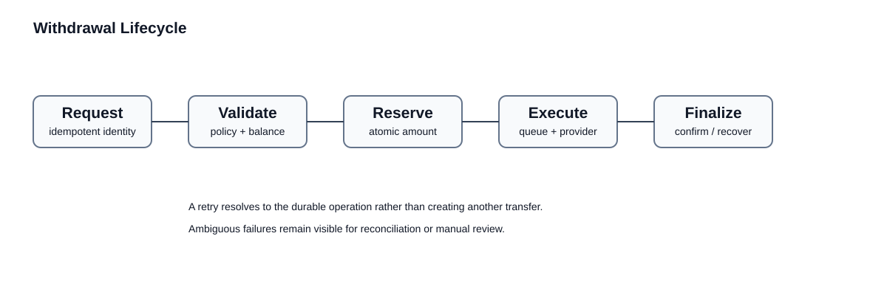

# TON Custody — Architecture Case Study

A technical case study of a production TON/Jetton custody service that isolates blockchain operations from the main application and provides reliable deposit, withdrawal, reconciliation, and treasury workflows.

The production service is private. This repository documents selected engineering patterns without publishing mnemonics, private keys, wallet addresses, HMAC secrets, internal endpoints, allowlist addresses, customer data, or deployment configuration.

## Engineering focus

Custody infrastructure has to remain understandable when the network, provider, queue worker, or calling application fails at an inconvenient point.

The system is designed around durable operation identities, idempotent workflows, explicit state transitions, replay-resistant service authentication, outbox delivery, reconciliation, and recovery paths.

## Core capabilities

- TON wallet operations
- Jetton balances and transfers
- deposit detection and confirmation
- durable deposit outbox delivery
- withdrawal lifecycle management
- reserved balances
- HMAC-authenticated service API
- timestamp and nonce replay protection
- idempotent mutation requests
- webhook / polling / backfill ingestion
- treasury reconciliation
- custody snapshots
- workflow reconciliation
- operational audit metadata

## High-level architecture

The custody service owns blockchain-facing state and exposes a restricted service API. The main application does not need direct access to wallet secrets or provider-specific blockchain logic.

## Deposit pipeline

Confirmed deposits are normalized into durable local state before delivery to the consuming application. Delivery is performed through an outbox rather than coupling blockchain ingestion directly to a remote HTTP request.

See [Deposit delivery](docs/deposit-delivery.md).

## Withdrawal lifecycle

Withdrawal requests have durable local identities and explicit states. Mutating requests use idempotency so retries resolve to the original operation instead of creating another transfer.

See [Withdrawals](docs/withdrawals.md).

## Signed service API

Sensitive service calls use authenticated request metadata including client identity, timestamp, nonce, signature, and an idempotency identity for state-changing operations.

Production policy can additionally require HTTPS, a restricted source network, bounded request sizes, and rate limits.

See [Service security](docs/service-security.md).

## Reconciliation

Recovery tooling can compare durable internal records with observed blockchain state and reconstruct missing workflow state where appropriate.

Examples include treasury reconciliation, deposit outbox reconciliation, workflow reconciliation, NFT state synchronization, and controlled historical backfill.

See [Reconciliation](docs/reconciliation.md).

## Custody accounting

A custody snapshot can compare internal obligations with externally observed assets without silently assuming that either side is always correct. The goal is operational evidence: if state drifts, the difference should be measurable and investigable.

## TON and Jettons

TON and Jetton operations share reliability principles but do not assume identical data models. Jetton amounts are handled as atomic integer values, avoiding floating-point arithmetic for token accounting. Reserved amounts are tracked explicitly for in-progress operations.

## Failure model

The design assumes webhooks may be duplicated or delayed, polling can temporarily miss activity, HTTP responses can be lost, workers can restart, providers can time out after accepting an operation, and internal/external state can disagree.

See [Failure recovery](docs/failure-recovery.md).

## Why this repository exists

A blockchain integration demo can send a transaction. Production custody infrastructure must also answer what happens if the response is lost, the event is delivered twice, a worker dies, delivery to another service fails, or accounting no longer matches observed assets.

This repository documents the architecture used to make those situations traceable and recoverable while keeping production secrets and source code private.
