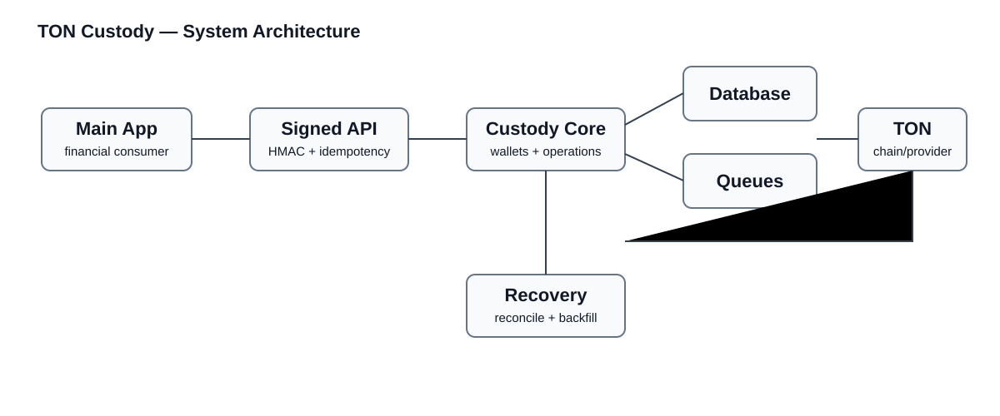
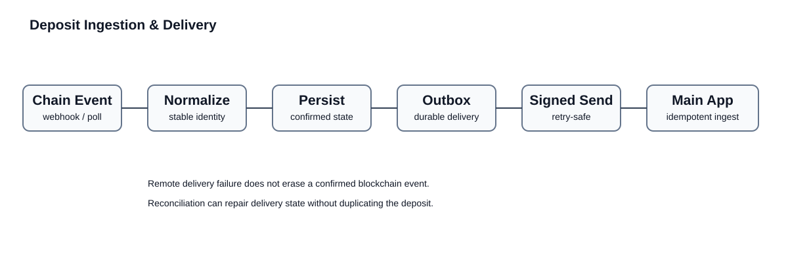
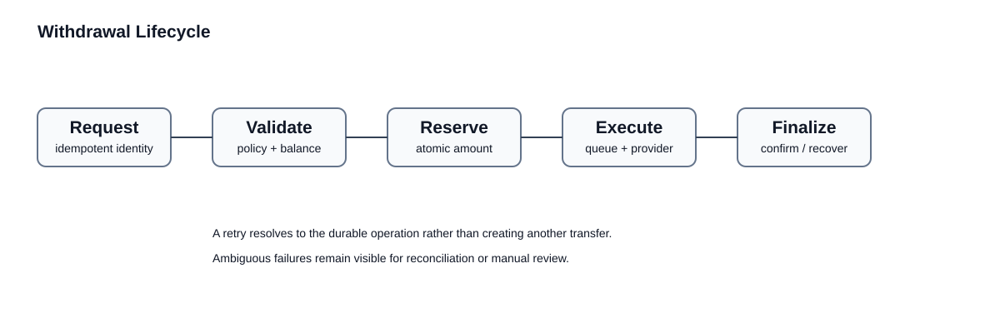

# TON Digital Asset Infrastructure — Architecture Case Study

A technical case study of production-oriented TON infrastructure covering custody, Jetton accounting, DEX execution, NFT lifecycle operations, treasury workflows, reconciliation, and recovery.

The production service is private. This repository documents selected engineering patterns without publishing mnemonics, private keys, wallet addresses, HMAC secrets, internal endpoints, allowlist addresses, customer data, provider credentials, or deployment configuration.

## Engineering focus

Sending a blockchain transaction is the easy part. Production digital-asset infrastructure must remain understandable when a provider times out after submission, a webhook arrives twice, a queue worker restarts, a quote expires, an NFT mutation succeeds on-chain but local synchronization fails, or internal accounting disagrees with observed blockchain state.

The system is therefore designed around durable operation identities, explicit state transitions, idempotency, reserved balances, asynchronous confirmation, replay-resistant service authentication, outbox delivery, reconciliation, and controlled recovery.

## Capability map

| Layer | Selected capabilities |
| --- | --- |
| Custody | TON wallets, deposits, withdrawals, reservations, treasury operations |
| Jettons | asset registry, atomic-unit balances, transfers, withdrawal confirmation, synchronization |
| DEX | quotes, slippage bounds, minimum output, gas-budget validation, durable swap requests, async confirmation |
| NFT | collection deployment, mint, transfer, TEP-64 metadata, on-chain verification, read-model synchronization |
| Reliability | idempotency, outbox delivery, polling/webhook/backfill ingestion, reconciliation, repair workflows |
| Security | HMAC service API, nonce replay protection, 2FA/IP-restricted administration, secret isolation, audit metadata |

## High-level architecture

Blockchain-facing state and signing responsibilities are isolated from the consuming application. External provider responses are treated as evidence, not as the sole source of durable workflow state.

## Custody and deposit pipeline

Confirmed deposits are normalized into durable local state before delivery to the consuming application. Delivery uses an outbox so blockchain ingestion is not coupled to remote HTTP availability.

See [Deposit delivery](docs/deposit-delivery.md).

## Withdrawal lifecycle

Withdrawals have durable identities and explicit states. Amounts required by in-progress operations are reserved. Retrying a mutation resolves to the original operation instead of creating another transfer.

See [Withdrawals](docs/withdrawals.md).

## Jetton accounting

TON and Jettons share reliability principles without pretending they have identical data models. Token amounts are represented as atomic integers, wallet-level balances can distinguish observed, reserved, and available amounts, and confirmation is asynchronous.

The important invariant is that an application retry must not become a second financial mutation.

## DEX execution

A swap is modeled as a workflow, not as a synchronous “swap” RPC call.

A quote records the input/output assets, atomic amounts, minimum acceptable output, slippage, gas budget, provider identity, resolver data, and expiration. Creating the swap requires a separate idempotency identity. Submission and confirmation happen asynchronously, and uncertain outcomes can move to explicit review rather than being guessed.

See [DEX swaps](docs/dex-swaps.md).

## NFT lifecycle

NFT support is treated as blockchain infrastructure rather than media upload functionality.

The architecture covers deterministic Collection deployment, TEP-64 metadata validation, minting, transfers, on-chain verification, and synchronization of a local read model. An on-chain success followed by a local synchronization failure is recoverable through reconciliation instead of being treated as a failed mint.

See [NFT lifecycle](docs/nft-lifecycle.md).

## Signed service API

Sensitive service calls use authenticated request metadata including client identity, timestamp, nonce, signature, and an idempotency identity for state-changing operations.

Replay protection and idempotency solve different problems: the nonce rejects replay of an authenticated request, while the idempotency identity makes a legitimate retry converge on the same durable operation.

See [Service security](docs/service-security.md).

## Reconciliation

Normal processing and reconciliation are deliberately separate.

Recovery tooling can compare durable internal records with observed blockchain state, reconstruct missing workflow state where safe, synchronize read models, audit deposit delivery, reconcile treasury movements, and repair one-way publication failures.

See [Reconciliation](docs/reconciliation.md).

## Failure model

The design assumes:

- webhooks may be duplicated, delayed, or unavailable
- polling may temporarily miss activity
- a provider may accept a transaction and then time out
- workers may restart between submission and persistence
- DEX quotes expire and execution results require independent confirmation
- an NFT mutation may succeed on-chain before local synchronization completes
- delivery to another application may fail after local state is durable
- internal and externally observed balances may disagree

When automation cannot prove a safe transition, the preferred state is explicit uncertainty or manual review rather than a fabricated success/failure result.

See [Failure recovery](docs/failure-recovery.md).

## Sanitized examples

The examples are deliberately small and non-runnable. They illustrate domain boundaries without reproducing production implementation:

- [Custody operation](examples/CustodyOperation.php)
- [Outbox record](examples/OutboxRecord.php)
- [DEX swap operation](examples/DexSwapOperation.php)
- [NFT asset record](examples/NftAssetRecord.php)

## Why this repository exists

A blockchain demo proves that a transaction can be sent.

Production digital-asset infrastructure must additionally answer:

- What if the response is lost after broadcast?
- What if the same authenticated mutation is retried?
- What if a DEX quote expires between approval and execution?
- What if the chain confirms an NFT mint but the database update fails?
- What if an event is delivered twice?
- What if accounting no longer matches observed assets?
- Can recovery be repeated safely and audited afterwards?

This repository documents the architecture used to make those situations traceable and recoverable while keeping production source code, secrets, infrastructure, and customer data private.

## Related production work

The case study is based on engineering patterns implemented in a private/production-oriented TON service. Public material is intentionally sanitized and focuses on architecture rather than copy-paste deployment.

## Contact

Backend, FinTech, blockchain infrastructure, AI agents, CRM automation and system architecture:

- Website: https://ifreework.com
- Telegram: https://t.me/ifwcom
